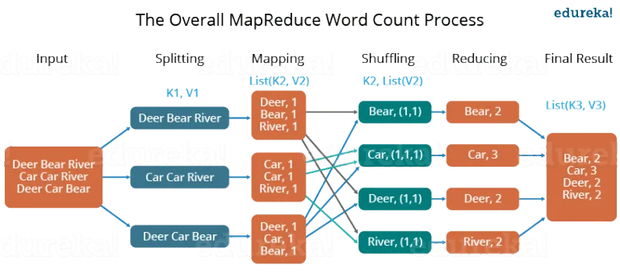

# Övning: `palinda-2` – Concurrency Conundrums

Veckans övning ser ut såhär:

- Info om DD1396
- Redovisning `palinda-2` – Concurrency Conundrums
    - Diskussion
    - Presentation
- Inför `palinda-3` – Parallel Performance
    - MapReduce
- Kodningsuppgift


## Den här veckan (`palinda-2` – Concurrency Conundrums)

Diskutera veckans task i par:

- Hur har det gått?
    - Vad gick bra?
    - Vad har varit extra svårt?
- Skiljer sig era lösningar?
    - Om ja, hur skiljer de sig?
    - Om nej, hur skulle man kunna göra annorlunda?
    - Finns fördelar/nackdelar med de olika sätten?

## Nästa vecka (`palinda-3` – Parallel Performance)

### MapReduce

MapReduce är en programmeringsmodell för att processa stora mängder data genom parallellisering. Den utvecklades av Google och är inspirerad av funktionerna Map och Reduce som är vanliga inom *funktionell programmering*.

Den generella idén är att bryta upp en stor mängd data i **icke-överlappande** block (engelska: *chunks*) som processas parallellt och sedan slås ihop till ett slutgiltigt resultat.

#### Funktionell programmering

Funktionell programmering är ett paradigm (sätt att programmera) som är baserat på matematiska funktioner. Med matematiska funktioner menas funktioner som inte har några sidoeffekter (de ändrar inget utanför funktionen). Ett funktionellt programspråk är [Haskell](https://sv.wikipedia.org/wiki/Haskell_(programspr%C3%A5k)).


#### Map i Haskell (`map`)

Map tar en unär operation (en funktion med en parameter) och en lista som indata, och ger en ny lista som utdata. Den nya listan fås genom att applicera den unära operatorn på varje element i listan. I Haskell kallas Map för `map`.

###### Exempel: lista med heltal

```haskell
-- [1, 2, 3, 4] är en lista med talen 1, 2, 3 och 4

-- (+1) är en funktion som adderar 1 till ett tal
map (+1) [1, 2, 3, 4] = [1+1, 2+1, 3+1, 4+1]
                      = [2, 3, 4, 5] 

-- Vad blir detta?
map (^2) [1, 2, 3, 4] = ?

-- Vi kan även använda funktioner som inte ger tal,
-- vad blir till exempel det här?
map (>2) [1, 2, 3, 4] = ?
```

###### Exempel: lista med strängar

```haskell
-- ("hello" ++) är en funktion som prependar "hello" till en sträng

-- ["hello", "world"] är en lista med strängarna "hello" och "world"
map ("hello" ++) ["hello", "world"] = ?

-- Vad blir detta?
map ("" ++) ["hello", "world"] = ?
```

#### Reduce i Haskell (`foldl`)

Reduce tar en binär operation (en funktion med två parametrar), ett startelement och en lista, och ger ett element. Det nya elementet fås genom att börja med startelementet, sen "stoppa in" den binära operatorn mellan varje element i listan, och till sist "slå ihop" resultatet. I Haskell kallas Reduce för `foldl`.

> Namnet `foldl` är en förkortning av *fold left*. Ordet *fold* används eftersom vi "viker ihop" alla element till ett enda, och *left* anger att den binära operatorn är *vänsterassociativ*.


##### Exempel: summering av tal

```haskell
-- [1, 2, 3, 4] är en lista med talen 1, 2, 3 och 4

-- (+) är vanlig addition
foldl (+) 0 [1, 2, 3, 4] = ((((0 + 1) + 2) + 3) + 4) -- Vänsterassociativ operation
                         = 0 + 1 + 2 + 3 + 4         -- "+" är associativ, så ordning spelar ingen roll
                         = 10

-- Vad blir detta?
foldl (*) 1 [1, 2, 3, 4] = ?

-- Och detta?
foldl (++) [] ["H", "a", "s", "k", "e", "l", "l"] = ?
```

> Känner ni igen de två översta funktionerna?


#### Hur MapReduce fungerar

MapReduce består av följande steg:

1. Först delar vi upp datan i olika de olika blocken, som skickas till Map i nästa steg.
2. **Map** skapar en lista med nyckel/värde-par för varje element blocket.
3. **Shuffle** grupperar och sorterar datan (dvs. alla nyckel/värd-par).
4. **Reduce** aggregerar (slår ihop) datan och levererar resultatet.



*Schematisk bild av MapReduce (tagen från [medium.com](https://medium.com/edureka/mapreduce-tutorial-3d9535ddbe7c)).*

##### Exempel: räkna ord

Antag att vi får ett block med texten $\text{"Car River Car"}$:

1. **Map** skapar för varje ord $w$ ett par $(w, 1)$, alltså det räknar ordet en gång:

$$\text{"Car River Car"} \to [ (\text{"Car"}, 1), \ (\text{"River"}, 1), \ (\text{"Car"}, 1)] $$

2. **Shuffle** grupperar och sorterar alla ord (efter nyckeln):

$$[ (\text{"Car"}, 1), \ (\text{"River"}, 1), \ (\text{"Car"}, 1)] \to [(\text{"Car"}, \ \lbrace 1, 1 \rbrace), \ (\text{"River"}, \lbrace 1 \rbrace)]$$

3. **Reduce** räknar ihop alla förekomster för varje unikt ord:

$$[(\text{"Car"}, \lbrace 1, 1 \rbrace), \ (\text{"River"}, \lbrace 1 \rbrace)] \to [(\text{"Car"}, 2 ), \ (\text{"River"}, 1 )]$$

Och nu har vi räknat alla ord!

> Varför gör vi ett par med en etta för varje ord? Det känns onödigt krångligt.
<!-- MapReduce är mer generell, man vill kunna mappa och reducera andra typer av data. Räkningen är bara ett exempel. -->

### **Kodningsövning: oändlig binär sekvens**

Tillbaka till Go! Veckans uppgift är att utnyttja indeterminism för att generera en slumpmässig ström av binära tal.

Uppgiften är att använda kanaler för att generera och printa en oändlig slumpad binär sekvens, det vill säga ettor och nollor, t.ex. `11001001...`. Siffrorna ska printas en i taget. Se till att det blir en liten paus mellan det att varje siffra printas.

> OBS: Det är inte tillåtet att använda `math/rand` för den här uppgiften.

#### Bonusuppgift

Se ifall ni kan printa speciella mönster, t.ex. `101010101...` (varannan) eller `01001100011100001111...` (en, två, tre, etc. ettor och nollor).

> *Om ni blir klara kan ni börja med `palinda-3`.*

### **Sammanfattning**

- Funktionell programmering
- Haskell
- Map (`map`)
- Reduce (`foldl`)
- MapReduce
