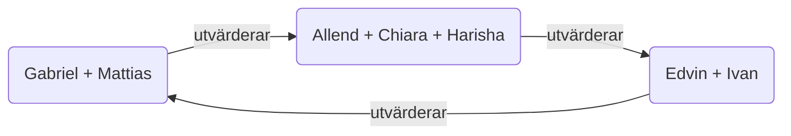

# Övning: `projinda-2` – Revision

Veckans övning ser ut såhär:

- Presentation
- Utvärdering
- Fortsatt arbete med projektet

### **Presentation**
Varje grupp presenterar så långt ni har kommit i projektet än så länge:

- Vad gör programmet?
- Vad är er planering i stora drag?
- Har ni lyckats hålla er till planen?
- Vad har ni stött på för problem hittils?
- Vad är ert fokus nu den sista veckan?
- Har ni några övriga tankar kring projektet?

### **Utvärdering**

Varje grupp utvärderar en annan grupps Github-repo enligt diagrammet:

För varje huvudpunkt i listan nedan öppnar ni *ett* issue och ger feedback gällande den punkten. Håll det kort och var konstruktiv. Reflektera gärna också över om ni lärt er något av hur den andra gruppen har arbetat. Punkterna att gå igenom är:

* Finns en tydlig projektbeskrivning?
    - Dokumentation (beskrivning av programmet)
    - Installationsguide (hur man installerar programmet)
    - Användarguide (hur man kör programmet)
* Är commit-loggen städad?
    - Tydliga commit-meddelanden
    - Många små commits istället för några få stora
* Används milestones eller andra planeringsfunktioner?
* Används issue-trackern för att lösa problem?
* Används branches och pull requests?

Blir ni klara kan ni fortsätta arbeta med projektet.

> [!NOTE]
> Om det blir problem att öppna issues: se till att era repon är öppna, eller lägg till någon från den andra gruppen som collaborators så att de kan skapa issues.

### **Nästa vecka**
* Sista övningen!
* Slutpresentation/demo
* Fika *(säg till nu eller skriv till mig om du har några allergier)*

