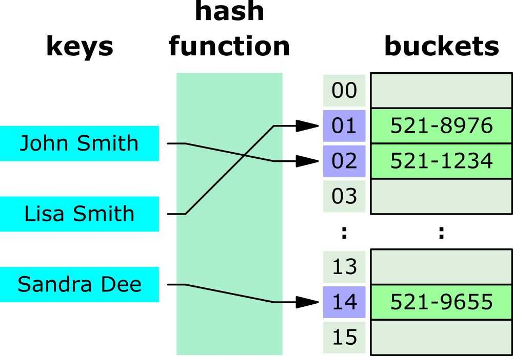

# Övning: `task-15` – Stacks

Veckans övning ser ut såhär:

- Repetition
    - `String` vs. `StringBuilder` i JShell
- Redovisning `task-15` – Stacks
    - Diskussion
    - Presentation
- Nytt i `task-16` – Hashtables
    - Hashfunktion
    - Hashtabell
    - `HashSet`, `HashMap` och `Hashtable`
- Kodningsuppgift

## Repetition: `String` vs. `StringBuilder` i JShell

Vi tittar på skillnaden mellan [`String`](https://docs.oracle.com/javase/8/docs/api/java/lang/String.html)-objekt som är *oföränderliga* (engelska: *immutable*) och [`StringBuilder`](https://docs.oracle.com/javase/8/docs/api/java/lang/StringBuilder.html)-objekt, som är *föränderliga* (engelska: *mutable*).

Metoden [`hashCode()`](https://docs.oracle.com/javase/8/docs/api/java/lang/Object.html#hashCode--) beräknar ett "hashat" värde för ett objekt (mer om det sen). Vad printas här under vid `(1)`, `(2)`, `(3)`, och `(4)`?

Diskutera i par vad ni tror kommer att hända.

```java
/*
 * String
 */
String s = "STRING";
System.out.println(s + " = " + s.hashCode()); // (1)
s += "moretext";
System.out.println(s + " = " + s.hashCode()); // (2)

/*
 * StringBuilder
 */
StringBuilder sb = new StringBuilder("STRINGBUILDER");
System.out.println(sb + " = " + sb.hashCode()); // (3)
sb.append("moretext");
System.out.println(sb + " = " + sb.hashCode()); // (4)
```

## Den här veckan (`task-15`: Stacks)

### Diskussion

Diskutera veckans task i par:

- Hur har det gått?
    - Vad gick bra?
    - Vad har varit extra svårt?
- Skiljer sig era lösningar?
    - Om ja, hur skiljer de sig?
    - Om nej, hur skulle man kunna göra annorlunda?
    - Finns fördelar/nackdelar med de olika sätten?

### Redovisning

En grupp redovisar veckans task.

## Nästa vecka (`task-16`: Hashtables)

### **Vad är ett hash / en hashfunktion?**
Ett *hash* (svenska: *kondensat*) är ett mindre tal som representerar ett större tal eller datamängd. Ordet betyder *pyttipanna* eller *sönderhackning* på engelska.

En hashfunktion är en *deterministisk* funktion som tar in data och returnerar ett tal som representerar datan. Samma invärde måste alltid ge samma utvärde. 

Antag till exempel att vi har en hashfunktion som tar in en sträng och returnerar summan av bokstäverna, där bokstävernas värde ges av deras index i alfabetet med start från `a = 1`.

För `"hej"` som indata får vi `23` som hash, eftersom

`hash("hej") = index('h') + index('e') + index('j') = 8 + 5 + 10 = 23`.

### **Hash table (abstrakt)**

Ett **hashtable** (svenska: *hashtabell*) är en datatyp som avbildar nycklar på (entydiga) värden. Det är en implementering av ADT:n associative array.

Tänk er att det fungerar som en funktion! Den här bilden (från [Wikipediasidan om hash tables](https://en.wikipedia.org/wiki/Hash_table)) ger en visualisering:



Hur det fungerar:
1. En nyckel ges till vårt hash table.
1. Nyckeln körs genom hash-funktionen och ger ett index.
1. Indexet används för åtkomst till datan.


#### **💬 Diskussion**
Vår hashfunktion från förra exemplet returnerade `23` för strängen `"hej"`. Vad blir resultatet för strängen `"han"`? Uppstår några problem? Hur kan man lösa problemet? Diskutera i par.

<details>
<summary>Svar</summary>

`hash("han") = index('h') + index('a') + index('n') = 8 + 1 + 14 = 23`.


Ett hash måste alltså inte vara *unikt*. Detta betyder att två olika indata **kan** ge samma hash, men samma indata **måste alltid** ge samma hash.

När två olika indata ger samma hash kallas det för en *kollision*.

</details>

### **Hash table (Java)**
Alla dessa klasser i Java implementerar ett hash table:

* [`HashSet`](https://docs.oracle.com/javase/8/docs/api/java/util/HashSet.html)
* [`HashMap`](https://docs.oracle.com/javase/8/docs/api/java/util/HashMap.html)
* [`Hashtable`](https://docs.oracle.com/javase/8/docs/api/java/util/Hashtable.html)

`HashSet` implementerar interfacet [`Set`](https://docs.oracle.com/javase/8/docs/api/java/util/Set.html).
`HashMap` och `Hashtable` implementerar båda interfacet [`Map`](https://docs.oracle.com/javase/8/docs/api/java/util/Map.html), men `HashMap` är att föredra.

## **Kodningsövning**
1. Bilda par som ni sitter.
1. Gör en egen hash-funktion. Funktionen ska:
    * ta in en sträng
    * returnera ett heltal som är samma för samma sträng
    * strunta i extra blanksteg (se nedan)
    * ge ett index $\ge 0$

Hantera extra blanksteg innebär här att till exempel `"  word"` (med ett blanksteg framför) och `"word"` (utan blanksteg) ska ge samma resultat.

> Om ni blir klara kan ni börja med `task-16`.

### **Sammanfattning**
* `String` vs. `StringBuilder`
* Hashfunktion
* Hashtabell